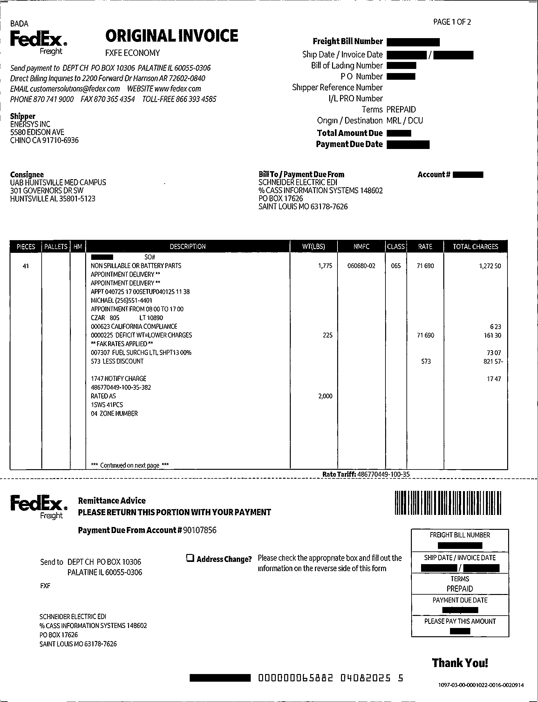

# Safe ID Masker

**Safe ID Masker** is a web-based application for automatic detection and masking of personally identifiable information (PII) in uploaded images and documents. It leverages OCR (Tesseract) to extract text and OpenAI GPT models to classify sensitive data, masking it directly on the image without affecting the rest of the document.

---




## Features

- **OCR Text Extraction:** Uses Tesseract to extract text and bounding box coordinates from images or PDF pages.
- **Automatic PII Detection:** Uses OpenAI GPT to identify sensitive information such as names, addresses, phone numbers, invoice numbers, amounts, and dates.
- **Pixel-Level Masking:** Draws black rectangles over detected PII areas while keeping the rest of the document intact.
- **File Upload & Download:** Supports PNG, JPG, and PDF file uploads; masked outputs can be downloaded immediately.
- **Simple Web Interface:** Users can upload documents, preview masked output, and download securely.
- **Environment Configuration:** API keys, file paths, and other settings stored in a `.env` file.
- **Optional Docker Support:** Includes Dockerfile and docker-compose setup for containerized deployment.

---

## Requirements

- Python 3.9+
- Flask
- OpenAI Python SDK
- pytesseract
- opencv-python
- pdf2image (for PDFs)
- Pillow
- python-dotenv

Optional:

- Docker & Docker Compose

---

## Installation

Clone the repository:

```bash
git clone https://github.com/yourusername/safe-id-masker.git
cd safe-id-masker
---
```
## Configuration (.env)
```
# OpenAI API key
OPENAI_API_KEY=sk-xxxxxxxxxxxxxxxxxxxxxxxxxx

# Tesseract OCR executable path
TESSERACT_PATH=C:\Program Files\Tesseract-OCR\tesseract.exe

# Folder to save masked files
UPLOAD_FOLDER=static/masked
```
---

## Architecture
```
User Upload
     │
     ▼
   Flask Server
     │
     ▼
  OCR Extraction (Tesseract)
     │
     ▼
 PII Detection (OpenAI GPT)
     │
     ▼
   Masking (OpenCV / PIL)
     │
     ▼
 Save & Download Masked File
```

## Usage

### Web Interface

Start the Flask server:

```bash
python app.py

```
## CLI Example (Python)

```
from pytesseract import image_to_data
import pytesseract
import cv2

# Load image
img = cv2.imread("invoice1.png")

# Extract OCR text with bounding boxes
data = pytesseract.image_to_data(img, output_type=pytesseract.Output.DICT)

print(data['text'])  # List of detected words
print(data['left'], data['top'], data['width'], data['height'])

```
## GPT PII Detection Example
```
Request Payload Sent to GPT:

{
  "model": "gpt-4o-mini",
  "messages": [
    {"role": "system", "content": "You are a PII detection tool. Return only JSON list of strings."},
    {"role": "user", "content": "Here is extracted text: 'John Doe, 123 Main St, 555-1234'. Return PII."}
  ]
}
```
## Masking PII with OpenCV
```
import cv2

for i, word in enumerate(data["text"]):
    if word in pii_words:
        x, y, w, h = data['left'][i], data['top'][i], data['width'][i], data['height'][i]
        cv2.rectangle(img, (x, y), (x + w, y + h), (0, 0, 0), -1)

cv2.imwrite("masked_invoice.png", img)
```
## PDF Handling
```
from pdf2image import convert_from_path

pages = convert_from_path('document.pdf', dpi=300)
for i, page in enumerate(pages):
    page.save(f"page_{i}.png", "PNG")
```
